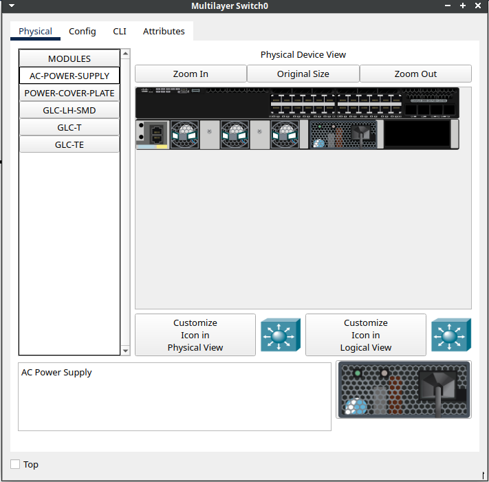
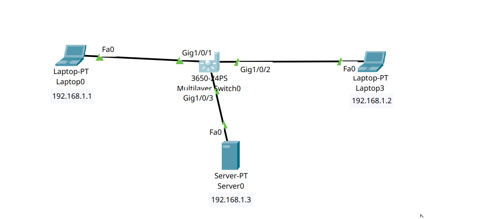
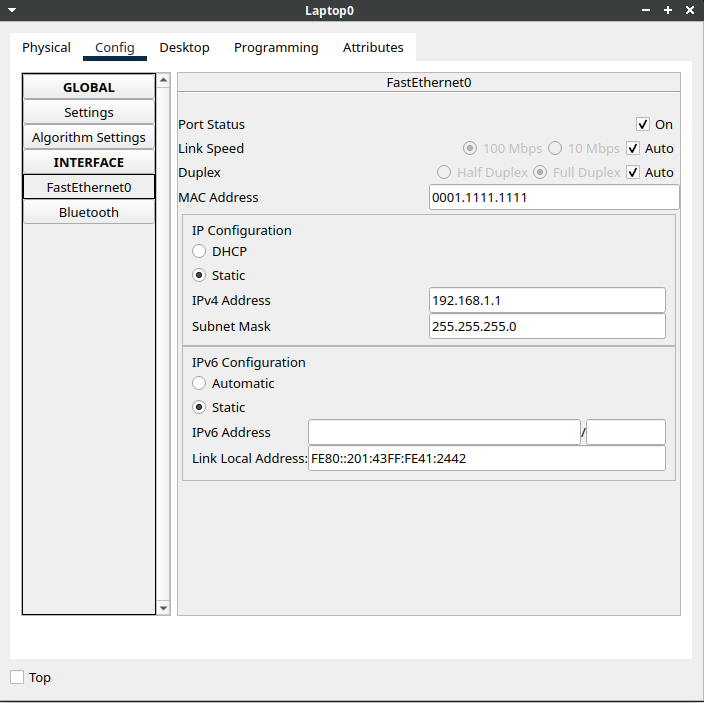
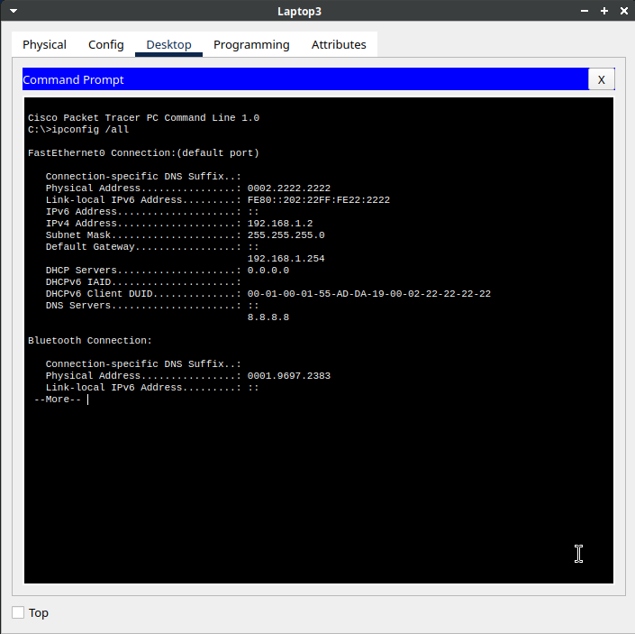
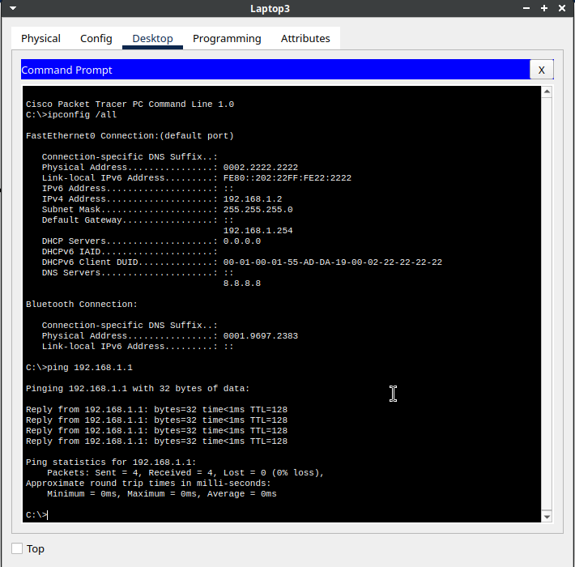

In Cisco Packet Tracer, we can configure IP addresses and establish network connectivity between clients and switches.

First, we must connect the power supply to the switch.

---

---

---

- The `ipconfig` command displays your IP address configuration.
- The `ipconfig /all` command displays detailed network configuration, including the MAC address and DNS server information.

---

We can use `ping` to verify that network connectivity is successful.

