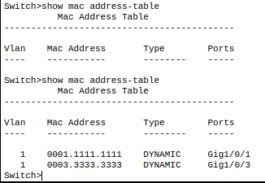
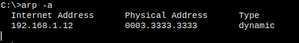
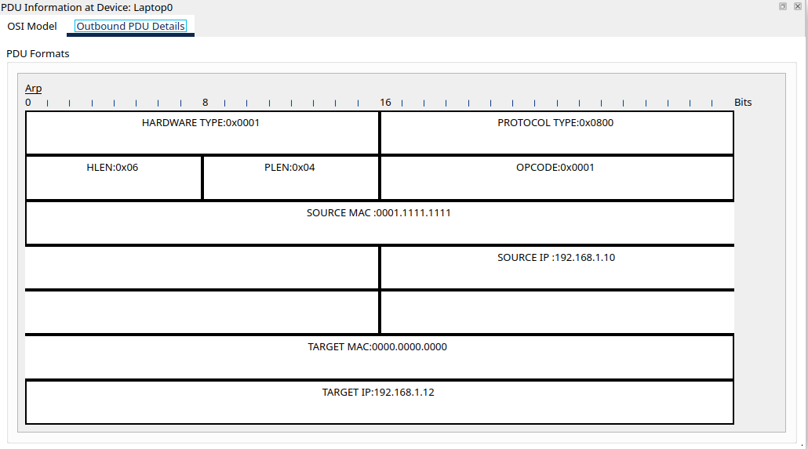
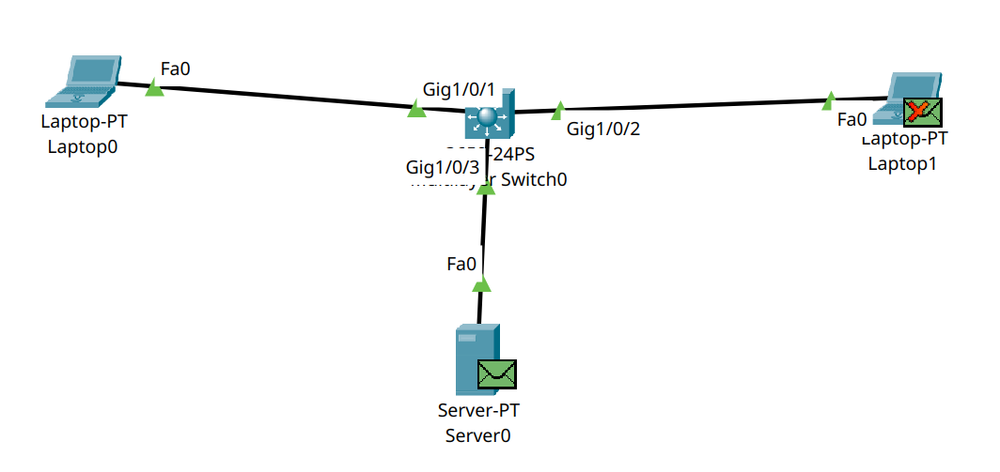

# Switch CLI

We can enter privileged EXEC mode.
```
Switch>enable
```
Then we can leave this mode.
```
Switch#>disable
```
---
We can enter configuration mode.
```
Switch#>configure terminal
```
Then we can leave this mode.
```
Switch(config)#>end
```
---
We can change the switch name.
```
Switch(config)#>hostname myswitch
```
```
myswitch(config)#>
```
---
We can use `?` to check command options, and if there is only one possible completion, we can press `Tab` to complete it.
```
Switch#>con?
```
output
```
configure connect
```
---
We can check the MAC address table to see if the switch has learned MAC addresses. For this to work, there must be traffic between devices first.



---

# ARP

Computers keep MAC addresses using ARP. If we cleared the ARP cache with `arp -d` or have not sent traffic yet, ARP entries appear after sending or receiving traffic, and we can view them with `arp -a`.



---

If our computer does not know the target MAC address (when the ARP list is empty), it cannot write the correct target MAC in the packet, so the switch sends the packet to everyone. Devices with a different IP drop the packet, and the matching device replies so the source computer can learn its MAC address.



